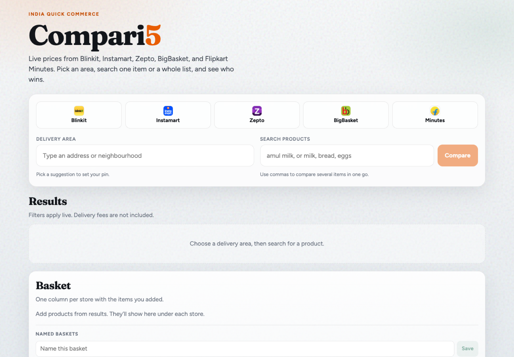
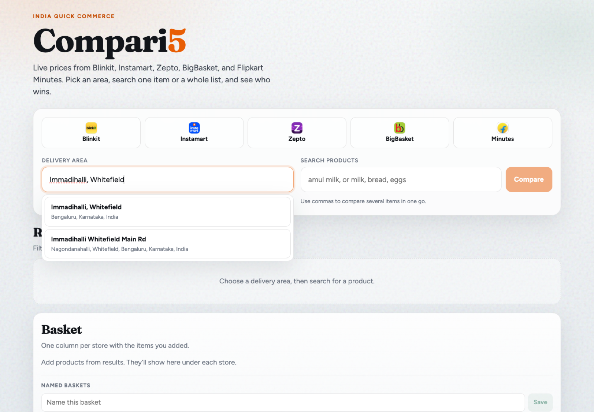
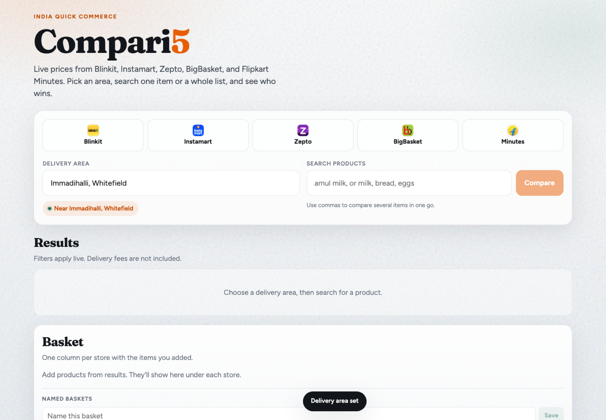
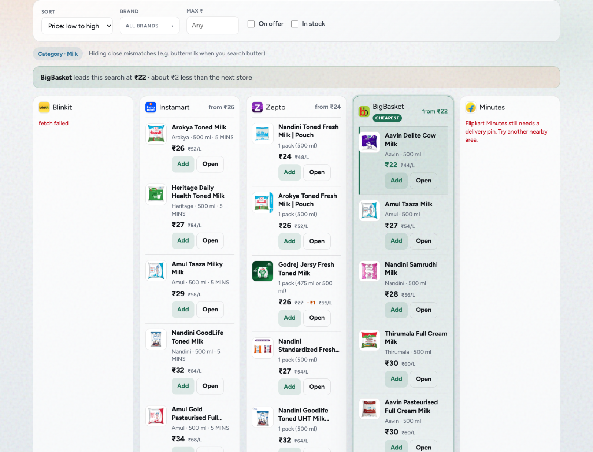
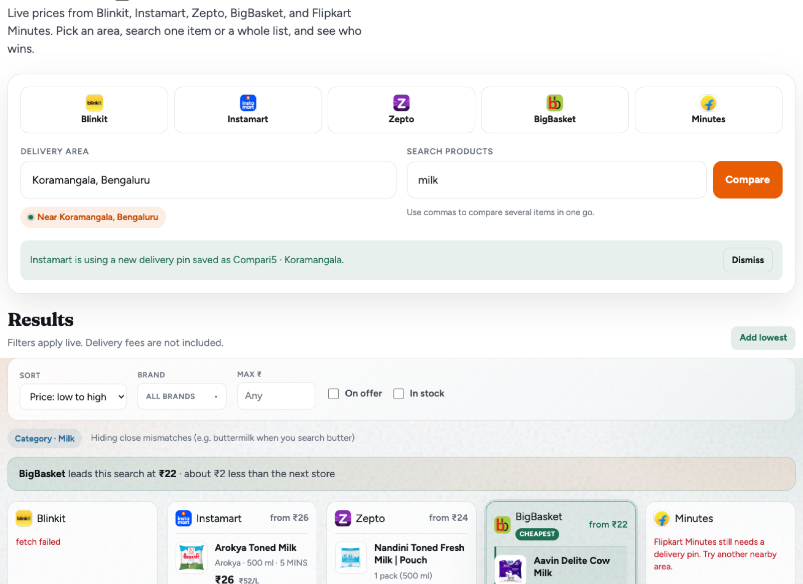
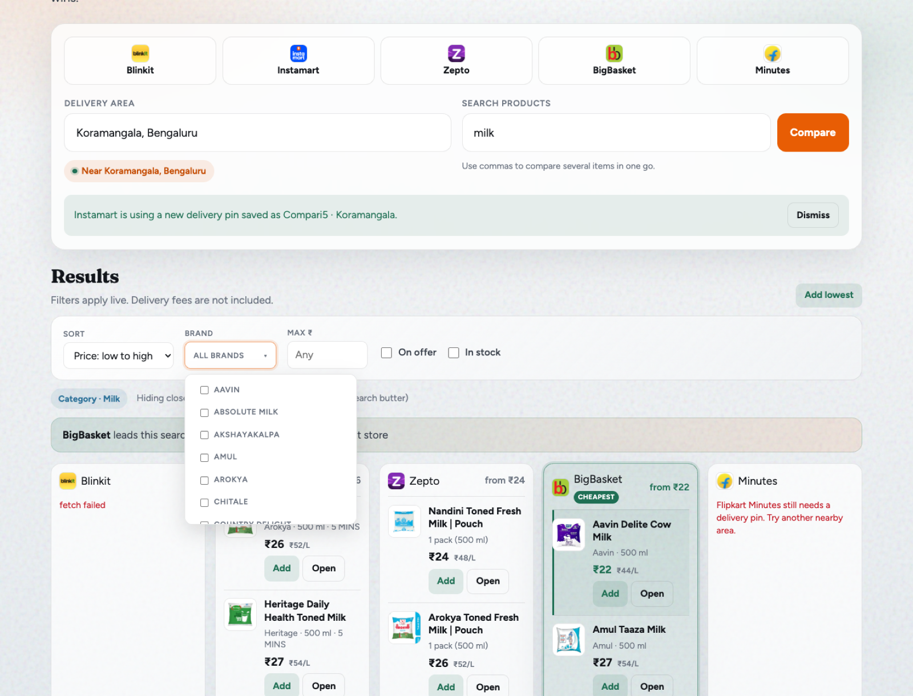
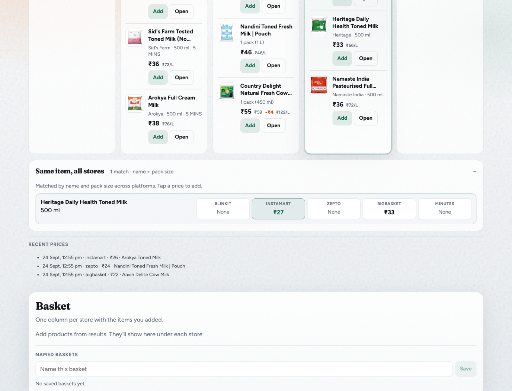

# Compari5

Live price compare across **Blinkit**, **Swiggy Instamart**, **Zepto**, **BigBasket**, and **Flipkart Minutes**.

**Live:** [https://compari5.netlify.app](https://compari5.netlify.app)

Unofficial personal tool — no checkout, not affiliated with any store.

For how each store and Google Maps are wired, see **[IMPLEMENTATION.md](./IMPLEMENTATION.md)**.

---

## What it looks like

### Home

Pick a delivery area, type a product (or a comma-separated list), hit **Compare**.



### Set delivery area (Google Places)

Type a neighbourhood → pick a suggestion → pin is set.





### Compare results

One column per store. Cheapest column is highlighted. Filters (sort, brand, max price, on offer) apply live.





### Brand multi-select

Filter to one or more brands without leaving the results view.



### Same item across stores

Expand **Same item, all stores** under the grid to see matched pack sizes side by side. Tap a price to add it to the basket.



---

## How to use (30 seconds)

1. Open the [live site](https://compari5.netlify.app) (or run locally).
2. **Delivery area** → type an address → pick a suggestion (green chip = pin set).
3. **Search products** → e.g. `milk` or `milk, bread, eggs` → **Compare**.
4. Browse columns → **Add** to basket, or **Open** the product on the store site.
5. Optional: sort / brand / max ₹ filters; expand the match board under the grid.

**Tips**

- Delivery fees are not included.
- Relevance hides close mismatches (e.g. buttermilk when you search butter).
- One store failing does not block the others.

---

## Local setup

```bash
git clone https://github.com/ironman-gampala/compari5.git
cd compari5
npm install
cp .env.example .env.local
```

Edit `.env.local`:

```bash
GOOGLE_MAPS_API_KEY=your_key_here
COMPARI5_BASE_URL=http://localhost:3000
```

Enable **Places API (New)** and **Geocoding API** in [Google Cloud Console](https://console.cloud.google.com/apis/library), then:

```bash
npm run dev
```

Open [http://localhost:3000](http://localhost:3000).

---

## Netlify deploy

| Variable | Purpose |
|----------|---------|
| `COMPARI5_BASE_URL` | `https://compari5.netlify.app` |
| `GOOGLE_MAPS_API_KEY` | Places + Geocoding |
| `BLINKIT_PROXY_URL` | Home Impit tunnel (`https://….trycloudflare.com`) |
| `BLINKIT_PROXY_SECRET` | Same secret as the home proxy |

```bash
npx netlify deploy --build --prod
```

**Auth on the live site**

- **Instamart:** OTP at `/api/auth/swiggy` (tokens shared via Netlify Blobs).
- **Zepto:** OTP must run on **localhost** (Zepto rejects Netlify redirect URIs), then:
  ```bash
  npm run sync:zepto-auth
  ```
- **Blinkit / Minutes on Netlify:** keep the home proxy + Cloudflare tunnel running (`services/blinkit-proxy/start-home-tunnel.sh`). Cloud IPs are often blocked.

Details: [IMPLEMENTATION.md](./IMPLEMENTATION.md) and `services/blinkit-proxy/README.md`.

---

## Project layout

```
app/                  # Next.js UI + API routes
  api/search/         # Parallel platform search
  api/geocode/        # Google Places / Geocoding (+ Nominatim fallback)
  api/auth/           # Swiggy / Zepto OAuth
lib/platforms/        # blinkit, instamart, zepto, bigbasket, minutes
lib/auth/             # MCP OAuth + token store
lib/postal.js          # Indian pin enrichment
services/blinkit-proxy/   # Home Impit proxy for Blinkit + Minutes
docs/screenshots/     # README images
IMPLEMENTATION.md     # How each integration works
```

---

## Scripts

| Command | Purpose |
|---------|---------|
| `npm run dev` | Local Next.js |
| `npm run build` | Production build |
| `npm run sync:zepto-auth` | Push local Zepto tokens to Netlify Blobs |
| `npx netlify deploy --build --prod` | Deploy |

---

## Security / privacy

- Do not commit `.env.local` or `.data/`.
- Live Instamart / Zepto sessions are **shared** for everyone on your Netlify URL.
- Treat the live link as a personal play tool.

## Disclaimer

Unofficial. Store APIs and MCPs can break or block without notice.
